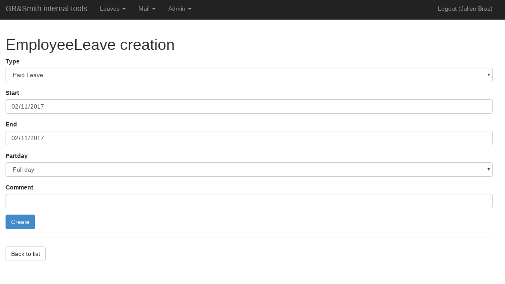
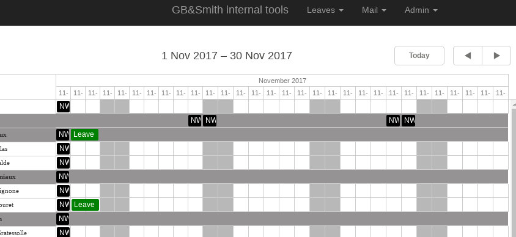

# GBS Internal website

## Description

This application have been designed to provide 2 basic features inside a typical company:
 * a leave system
  * allow employee to ask for leaves
  * allow manager to validate/refuse leaves
  * allow to see a global agenda of the whole company (who is on who is off)
 * a mail management system (for mail hosted on [OVH servers](https://www.ovh.com/fr/emails/))
  * user can manage mail responder
  * user can manage mail forwarder
  * user can see mailing list informations

## Leaves system features

  * employee self leave creation
  * manager validation
  * agenda view
  * allow to create 1/2 day of leave
  * manage a leave 'credit'
  * manage UK sick days

Custom tasks:
 * _gbs:leave:addholidaycredit_: Add monthly holiday credit depending of the country
 * _gbs:leave:addsickcredit_: Add yearly sick credit depending of the country
 * _gbs:leave:managermail_: Send a mail to manager in order to validate leaves (paid leave + travelling)
 * _gbs:leave:medicalvisit_: end a mail to specific people regarding medicial visit to be done in the next month

## Mail Management
  * permit a end user to create responder directly without accessing OVH console
  * permit a end user to create a forward directly without accessing OVH console
  * permit a end user to see the list of mailing list

## Installation

THis is a typically Symfony2 application. All the necessary package are installable via [Composer](https://getcomposer.org/):

    php composer.phar install

The parameters.yml file will be created by user input during the composer install. The application rely on a database (MySQL used but other DB is possible I think so). Then create the DB schema:

    php app/console doctrine:schema:update --force

To run the dev server:

    php app/console server:start

Then go to **http://localhost:8000** to see the app.

## Middleware integration

This application use to be connected to a LDAP directory, I have removed the corresponding but don't hesitate to ask I can put it back.

## Screenshots

## Contribution

Don't hesitate to PR or add an issue on the project.

## License

 This work
is licensed under a <a rel="license"
href="http://creativecommons.org/licenses/by-sa/4.0/">Creative Commons
Attribution-ShareAlike 4.0 International License</a>.

The application have been developed by the company
[GB&Smith](http://gbandsmith.com) a software editor for internal use initially.
It has been pushed with a open license on November 2017.